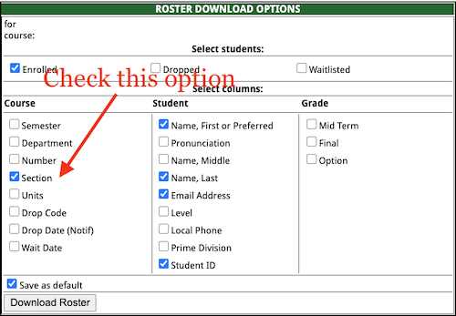

# Canvas LMS misc utilities
This repo contains some Canvas utility functions such as:
- [x] Automatically adding groups based on `.txt` section roster and the `.csv` course roster.
- [ ] Add an argument parser to customize the group name.
- [ ] Automatically sorting the bulk downloaded submission pdfs for Gradescope.

## Auto-group
The script for this function is `auto_group.py`. Please put the script in the same folder with (1) your course roster generated by the Canvas Group function, (2) the section rosters (preferably tabbed `.txt` files). Run
```python
python3 auto_group.py
```
to generate a processed course roster of which you can use to import the Groups. 


In the download roster option on WebFac, please mark the Section checkbox:



So that the `.txt` file can have a Section column to the `auto_group.py` script to recognize. The default naming of the Groups is `Section X` where `X` is the retried text from the Section column. 
